```markdown
<div align="center">

<!-- HERO -->
<br/>


```

 █████╗ ██╗     ██╗ ██████╗ ███╗   ██╗ ██████╗ ██████╗ ███████╗
██╔══██╗██║     ██║██╔════╝ ████╗  ██║██╔═══██╗██╔══██╗██╔════╝
███████║██║     ██║██║  ███╗██╔██╗ ██║██║   ██║██████╔╝███████╗
██╔══██║██║     ██║██║   ██║██║╚██╗██║██║   ██║██╔═══╝ ╚════██║
██║  ██║███████╗██║╚██████╔╝██║ ╚████║╚██████╔╝██║     ███████║
╚═╝  ╚═╝╚══════╝╚═╝ ╚═════╝ ╚═╝  ╚═══╝ ╚═════╝ ╚═╝     ╚══════╝

```

### The Governance Operating System for Enterprise Execution

*Not a goal tracker. The control layer that keeps 5,000 employees, managers, and governance teams aligned.*

<br/>

[](https://www.typescriptlang.org/)
[](https://nextjs.org/)
[](https://www.prisma.io/)
[](https://supabase.com/)
[](https://tailwindcss.com/)
[](https://vercel.com/)
[](/)
[](LICENSE)

<br/>

[**Live Demo**](#-demo-credentials) · [**7-Minute Walkthrough**](#-demo-flow) · [**Architecture**](#-architecture) · [**Setup**](#-quick-start)

<br/>

---

</div>

## The Problem

> **Enterprise execution doesn't fail because goals aren't written. It fails because no one can see when execution is breaking down - until it's too late.**

At scale, organizations face a structural visibility problem:

- Goal sheets live in spreadsheets and disconnected tools - **there is no execution control plane**
- Managers approve goals without risk context - **approvals become rubber stamps**
- Governance teams react to failures after quarterly reviews - **there is no early warning system**
- Audit trails exist only in emails and meeting notes - **accountability is unenforceable**
- Escalation is ad-hoc and untracked - **operational bottlenecks become invisible**

AlignOps is the layer that closes this gap. It is a **governance operating system** - not a productivity app - built to make execution, risk, and accountability observable at every level of an organization.

---

## What AlignOps Delivers

<table>
<tr>
<td width="33%">

### Employee Goal Cockpit
The structured workspace where employees define, refine, and execute quarterly goals with full governance accountability.

- **Progress rings** with live KPI confidence scoring
- **SMART criteria enforcement** with per-criterion signals
- **Quarterly timeline view** with phase tracking
- **Achievement forecasting** and trajectory nudges
- **Duplicate KPI detection** before submission
- **Blocker capture** and resolution tracking

</td>
<td width="33%">

### Manager Operating Center
The risk-aware operating layer where managers govern approvals, spot execution problems early, and maintain team health.

- **Prioritized approval queue** with risk scoring
- **Execution risk radar** surfacing high-stakes goals
- **Needs-attention queue** for delayed and at-risk sheets
- **Performance distribution** across direct reports
- **Escalation radar** with active escalation pressure
- **Teams/email notification simulation** with card previews
- **Manager effectiveness analytics**

</td>
<td width="33%">

### Admin Governance Control Tower
The policy and audit layer where HR governance teams run org-wide operations, enforce compliance, and export evidence.

- **Org execution health** with department heatmaps
- **Lifecycle matrix** across all active cycles
- **Audit intelligence** with full event traceability
- **Escalation tracking** and resolution management
- **Unlock intervention center** with reason capture
- **Operational metrics** and governance KPIs
- **CSV export** for downstream compliance reporting

</td>
</tr>
</table>

---

## Product Walkthrough

### Governance Control Tower

Enterprise-wide visibility into execution health, approvals, escalations, auditability, and governance operations.

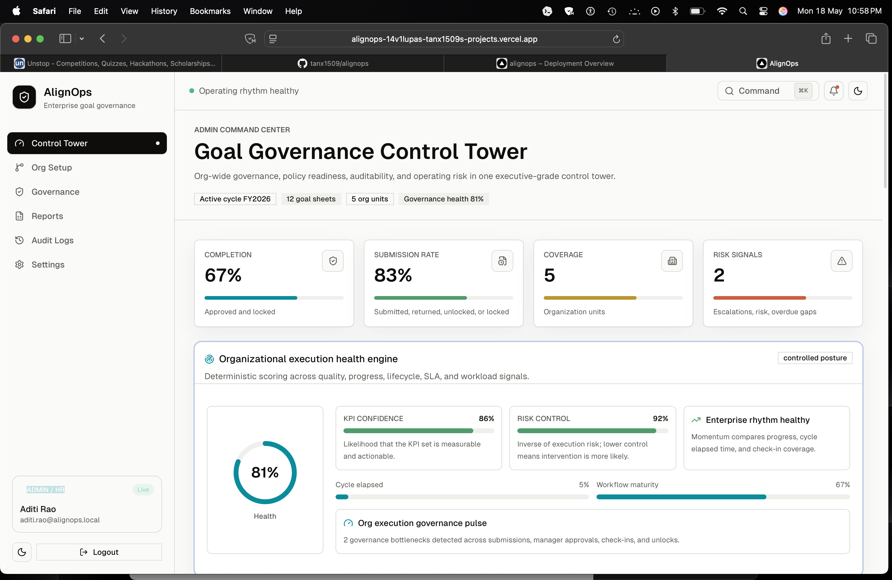

---

### Governance Audit Intelligence

Full governance traceability across approvals, escalations, interventions, and operational decisions.

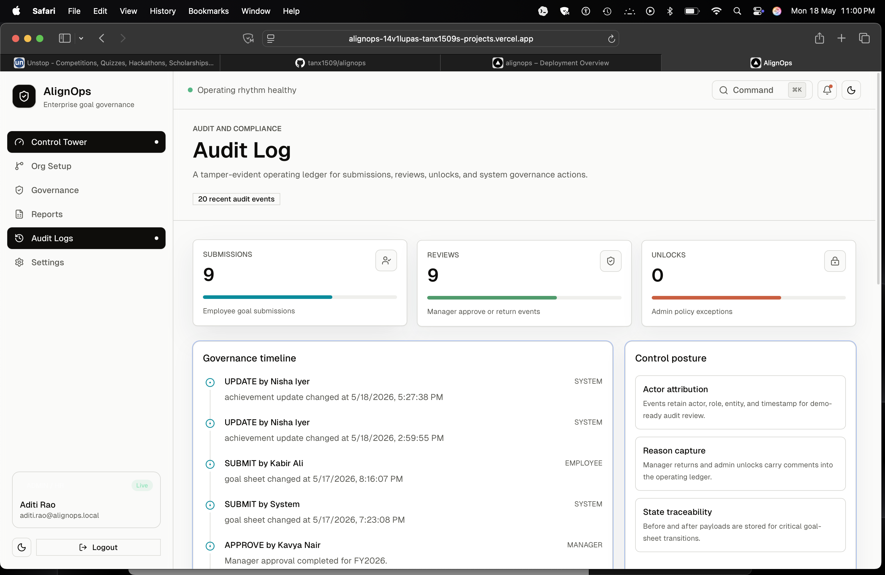

---

### Analytics & Governance Reporting

Operational analytics with reporting exports and organizational execution visibility.

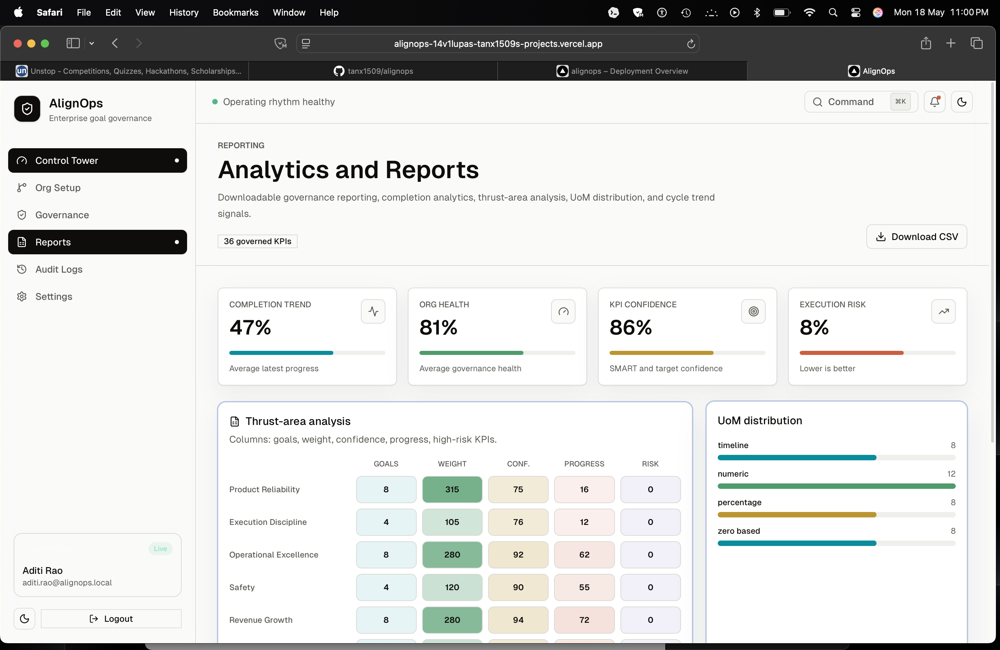

---

### Manager Operating Center

Managers review approvals, identify execution risks, monitor SLA aging, and govern team performance.

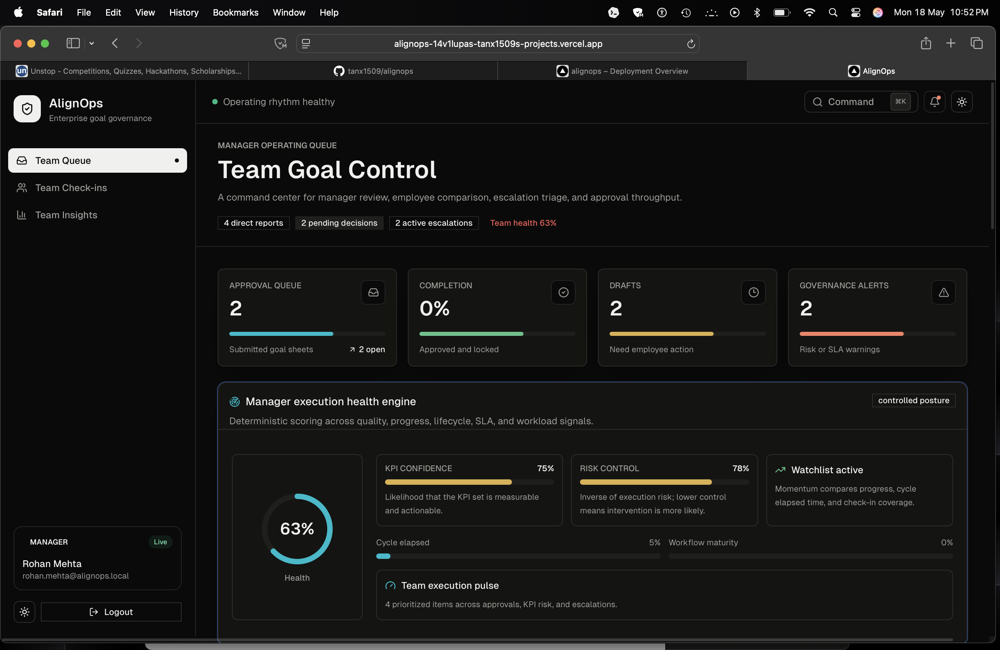

---

### Approval Workflow

Risk-aware approval flows with governance comments, escalation context, and audit persistence.

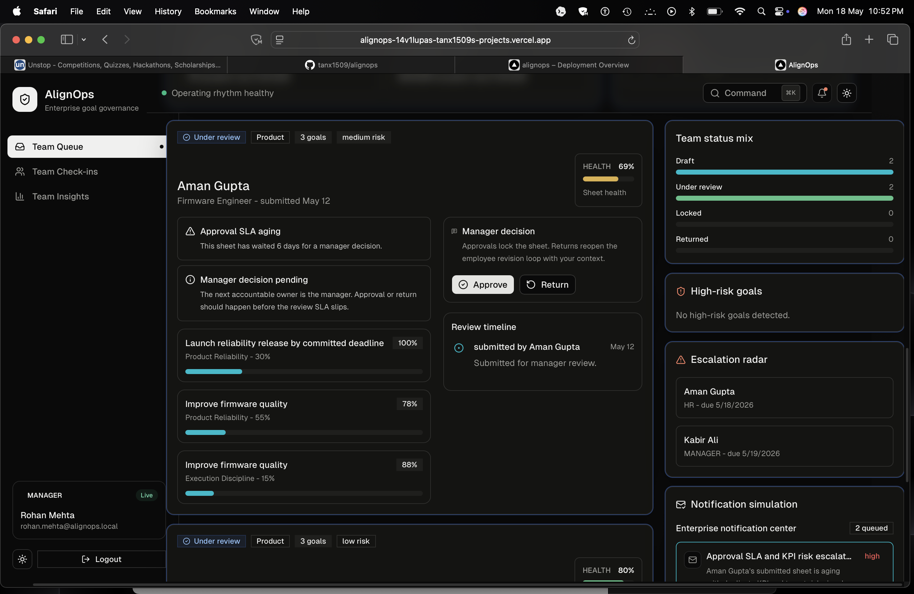

---

### Employee Goal Cockpit

Employees manage goals, KPI confidence, progress tracking, and execution readiness.

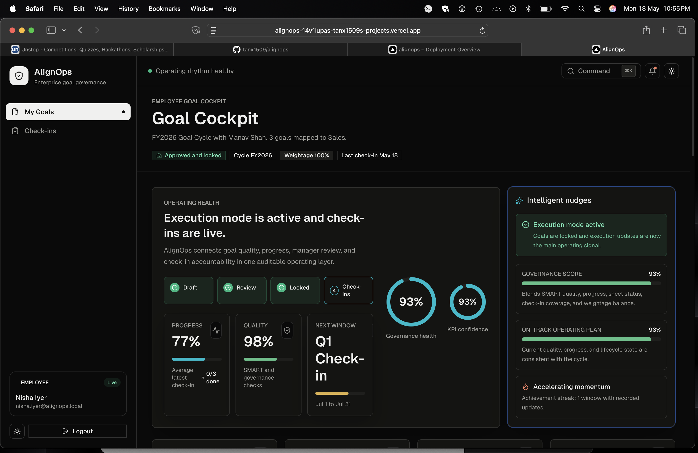

---

### Progress Journal

Structured quarterly check-ins and execution tracking across milestones.

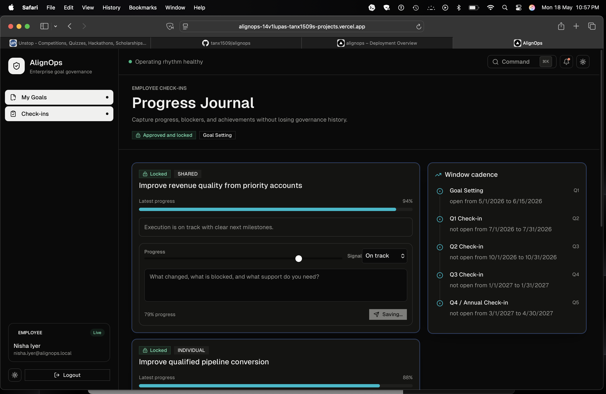

---

### Organizational Intelligence

Leadership visibility into execution bottlenecks, operational trends, and organizational health.

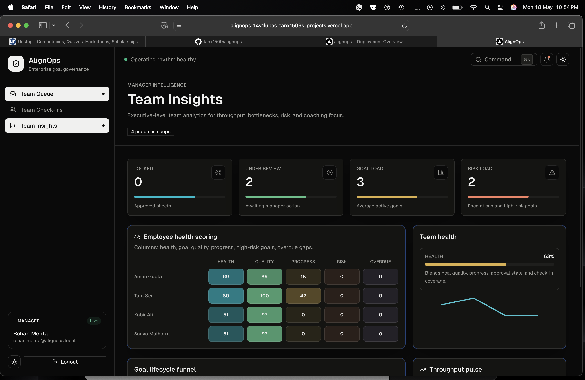

---

## Architecture

AlignOps is a **server-first modular monolith** designed for enterprise delivery velocity and credible scalability. Every architectural decision prioritizes auditability, role separation, and operational clarity.


```

┌─────────────────────────────────────────────────────────────────────┐
│                         ROLE PORTALS                                │
│    Employee Goal Cockpit  │  Manager Operating Center  │  Admin CT  │
└──────────────────────────────────────┬──────────────────────────────┘
                                       │
                         ┌─────────────▼─────────────┐
                         │    Next.js 14 App Router   │
                         │  Server Components · RSC   │
                         │  Protected Route Groups    │
                         └─────────────┬─────────────┘
                                       │
              ┌────────────────────────▼────────────────────────┐
              │              IDENTITY BOUNDARY                   │
              │     Supabase Auth  ·  Role Claims  ·  Sessions  │
              │         Middleware Guards  ·  RBAC API Layer     │
              └────────────────────────┬────────────────────────┘
                                       │
        ┌──────────────────────────────▼──────────────────────────────┐
        │                   DOMAIN SERVICE LAYER                       │
        │  Goal State Machine  ·  Approval Engine  ·  Zod Validation  │
        │  Execution Health Engine  ·  Escalation Rules               │
        │  Notification Dispatcher  ·  Reporting & CSV Pipeline       │
        └──────────────────────────────┬──────────────────────────────┘
                                       │
              ┌────────────────────────▼────────────────────────┐
              │           PERSISTENCE LAYER (Prisma ORM)         │
              │  PostgreSQL  ·  Audit Ledger  ·  Escalation Log  │
              │  Goal Sheets  ·  Org Units  ·  Role Assignments  │
              └─────────────────────────────────────────────────┘

```

### Full Layered Architecture

<details>
<summary>View full Mermaid architecture diagram</summary>

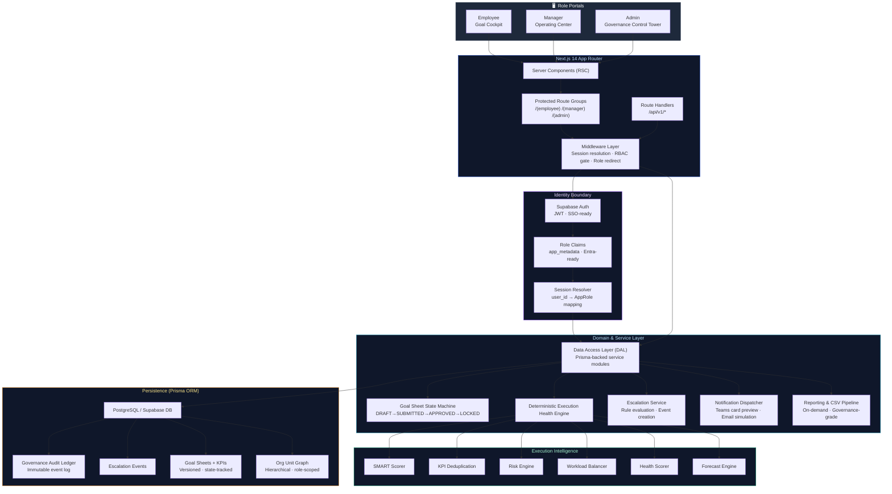

### Governance Lifecycle Flow

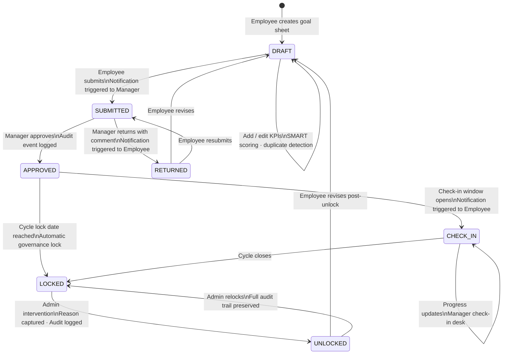

### Execution Intelligence Flow

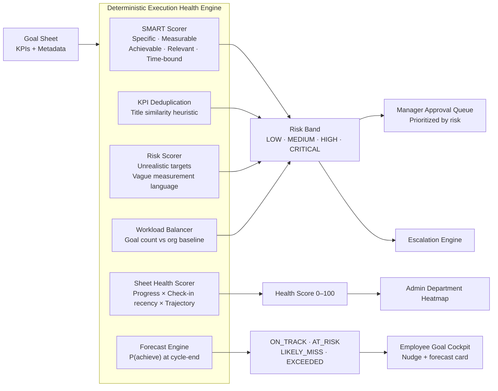

---

## Feature Matrix

| Capability | Employee | Manager | Admin |
| --- | --- | --- | --- |
| **Goal Sheet Creation & Editing** |  Full | - | - |
| **SMART Scoring & KPI Intelligence** | ✅ Live feedback | ✅ Risk context | ✅ Org-wide |
| **Goal Submission & Workflow** | ✅ Submit/revise | ✅ Approve/return | ✅ Override |
| **Quarterly Check-ins & Progress** | ✅ Self-update | ✅ Review desk | ✅ Tracking |
| **Shared Goal Participation** | ✅ Linked | ✅ Cross-team | ✅ Definition |
| **Execution Risk Visibility** | ✅ Own sheet | ✅ Full team | ✅ Org-wide |
| **Notification Center** | ✅ Receive | ✅ Receive/trigger | ✅ Full access |
| **Escalation System** | - | ✅ Radar view | ✅ Full management |
| **Governance Audit Trail** | - | Partial | ✅ Full ledger |
| **Unlock Intervention** | - | - | ✅ With audit |
| **Department Heatmaps** | - | - | ✅ Full |
| **CSV Export** | - | - | ✅ Governance-grade |
| **Org Analytics & Reporting** | - | Team-scope | ✅ Org-wide |
| **Manager Effectiveness Analytics** | - | Self-view | ✅ All managers |
| **Identity / RBAC** | Role-scoped | Role-scoped | Full control |

---

## Intelligence Layer

AlignOps ships a **deterministic execution health engine** - no external AI API costs, no hallucination risk, no rate limiting. Every signal is rule-based, reproducible, and auditable.

| Engine | What It Detects | Where It Surfaces |
| --- | --- | --- |
| **SMART Scorer** | Per-criterion quality signals across Specific, Measurable, Achievable, Relevant, Time-bound axes | Employee cockpit · Manager approval view |
| **KPI Deduplication** | Similar KPI titles across an employee's active goal sheets | Employee cockpit warning · Manager risk view |
| **Risk Scorer** | Unrealistic target delta, vague measurement language, weight distribution imbalance | Manager risk radar · Admin heatmap |
| **Workload Balancer** | Goal count vs organizational baseline, total weight sum validation | Employee cockpit · Manager queue |
| **Health Scorer** | Composite of latest progress, check-in recency, and achievement trajectory (0-100) | Manager team view · Admin heatmap |
| **Forecast Engine** | P(achieve) at cycle-end based on current progress rate and trajectory | Employee cockpit · Admin lifecycle matrix |
| **Governance Heuristics** | Approval SLA breach, submission deadline risk, check-in gap detection | Escalation engine · Admin escalation tracker |

---

## Architecture Principles

**Separation of Concerns** - Each business module (`goals`, `checkins`, `escalations`, `audit`, `reporting`, `org`, `shared-goals`) owns its own schema-facing services. Cross-module coordination is explicit, never implicit.

**DAL Boundary** - All database access goes through a typed Data Access Layer. No raw Prisma calls in route handlers or UI. Every persistence operation is instrumentable, testable, and auditable.

**RBAC at Every Layer** - Role enforcement happens at three independent checkpoints: Next.js middleware (session-level), API route handlers (request-level), and DAL service calls (data-level). Bypassing one layer does not bypass the system.

**Immutable Audit Ledger** - All governance-relevant events - approvals, returns, unlocks, escalations - are written to an append-only audit log table. The application never deletes audit records.

**Server-First Rendering** - React Server Components serve the majority of UI. Client components are used only where interactivity demands it. This reduces client JavaScript, improves load performance, and keeps sensitive data server-side.

**Extensibility by Default** - Role claim normalization is Entra-ready. The notification model is a structured queue with provider-agnostic dispatch - real Teams/email integration requires only a provider implementation, not an architecture change.

---

## Demo Credentials

> Use password `AlignOps@123` for all demo accounts.

| Role | Email | Story Arc |
| --- | --- | --- |
|  **Admin** | `aditi.rao@alignops.local` | HR governance owner. Sees full org execution health, runs audit intelligence, manages unlock interventions, exports compliance reports. |
|  **Manager (Overloaded)** | `rohan.mehta@alignops.local` | Product manager under pressure. High-risk approval queue, active escalations, overloaded team, Teams notification preview in action. |
|  **Manager (Healthy)** | `manav.shah@alignops.local` | Sales manager with a healthy operating rhythm. Approved sheets, lower risk signals, good team distribution. |
|  **Employee (Thriving)** | `nisha.iyer@alignops.local` | Strong progress, high KPI confidence, clean SMART scores, forecast shows on-track to exceed. |
|  **Employee (At-Risk)** | `aman.gupta@alignops.local` | Duplicate KPI signals, unrealistic target warnings, at-risk forecast - the intelligence engine working in real-time. |
|  **Employee (Escalated)** | `kabir.ali@alignops.local` | Delayed draft, active escalation event, visible in manager and admin views. |

---

### The Winning Moment

> Employee goal quality problem → manager receives risk-aware notification → manager governs with execution context → admin observes org-wide governance impact → compliance export produced.
> **That is a complete enterprise governance loop.**

---

## Screenshots

> *Recommended captures from the live demo environment for README embedding.*

| View | Description |
| --- | --- |
| `employee-cockpit.png` | Goal cockpit with progress rings, KPI confidence, SMART panel, quarterly timeline |
| `manager-queue.png` | Approval queue with risk scores, prioritization, execution radar |
| `manager-notification.png` | Notification center with Teams adaptive card preview |
| `admin-heatmap.png` | Department execution heatmap with health color bands |
| `admin-audit.png` | Audit intelligence panel with governance event timeline |
| `admin-reports.png` | Governance CSV export with thrust-area and QoQ analytics |

*Capture at 1440×900 PNG. GIF walkthroughs of each of the three Acts are strongly recommended for judges reviewing the repository asynchronously.*

---

## 📋 BRD Coverage Matrix

| Requirement | Status | Implementation |
| --- | --- | --- |
| Goal creation and SMART validation | ✅ Complete | Employee cockpit, Zod validation, SMART scorer, refinement modal |
| Manager approval workflow | ✅ Complete | Submitted queue, approve/return, comments, audit trail |
| Shared goals | ✅ Complete | Shared goal definitions, primary owner mapping, cross-team links |
| Quarterly check-ins and progress | ✅ Complete | Check-in windows, achievement updates, progress scoring |
| Role-based portals (Employee/Manager/Admin) | ✅ Complete | Three distinct operating layers with full RBAC |
| RBAC and protected routes | ✅ Complete | Middleware, server-side guards, API RBAC |
| Governance reporting | ✅ Complete | Admin dashboard, reports, CSV export, heatmaps |
| Audit trail | ✅ Complete | Immutable audit log, approval events, unlock capture |
| Escalation system | ✅ Complete | Escalation rules, events, manager radar, admin tracker |
| Deterministic execution intelligence | ✅ Complete | SMART, KPI dedup, risk, workload, health, forecast |
| Notification system | ✅ Simulated | Notification center with Teams/email card previews |
| Entra/SSO readiness | ✅ Placeholder | Role claim normalization, auth adapter, settings documentation |

| Good-to-Have | Status |
| --- | --- |
| Escalation rules and logs | ✅ |
| Approval SLA indicators | ✅ |
| Quarterly compliance tracking | ✅ |
| Downloadable CSV reports | ✅ |
| Manager effectiveness analytics | ✅ |
| QoQ trend charts | ✅ |
| Org-wide completion analytics | ✅ |
| Thrust-area analysis | ✅ |
| UoM distribution analysis | ✅ |
| Email/Teams simulation | ✅ |

Full BRD coverage map: [`docs/brd-coverage.md`](https://www.google.com/search?q=docs/brd-coverage.md)

---

## Quick Start

```bash
# 1. Clone and install
git clone [https://github.com/your-org/alignops.git](https://github.com/your-org/alignops.git)
cd alignops
npm install

# 2. Configure environment
cp .env.example .env.local
# Fill in Supabase project credentials

# 3. Initialize database
npm run db:generate
npm run db:migrate
npm run db:seed

# 4. Start development server
npm run dev
# → http://localhost:3000

```

### Environment Variables

```bash
# Database (Supabase PostgreSQL)
DATABASE_URL="postgresql://postgres:[password]@[host]:6543/postgres?pgbouncer=true&connection_limit=1"
DIRECT_URL="postgresql://postgres:[password]@[host]:5432/postgres"

# Supabase Auth
NEXT_PUBLIC_SUPABASE_URL="[https://your-project.supabase.co](https://your-project.supabase.co)"
NEXT_PUBLIC_SUPABASE_ANON_KEY="your-anon-key"
SUPABASE_SERVICE_ROLE_KEY="your-service-role-key"

# Application
NEXT_PUBLIC_APP_URL="http://localhost:3000"
SKIP_ENV_VALIDATION="false"

```

### Verify Build Integrity

```bash
SKIP_ENV_VALIDATION=true npm run typecheck
SKIP_ENV_VALIDATION=true npm run lint
SKIP_ENV_VALIDATION=true npm run build

```

All three must pass before demo deployment.

---

## Deployment

### Supabase (Database + Auth)

1. Create a new Supabase project
2. Copy connection strings from **Settings → Database**
3. Create Auth users for the 6 demo emails with password `AlignOps@123`
4. Run migrations and seed: `npm run db:deploy && npm run db:seed`

### Vercel (Application)

1. Import repository into Vercel
2. Add all environment variables under **Settings → Environment Variables**
3. Deploy - build command is `npm run build`
4. Verify deployment URL resolves and redirects to login

### Post-Deployment Checklist

* [ ] All 6 demo credentials resolve to correct role dashboards
* [ ] Seeded governance data is visible across all three portals
* [ ] CSV export produces output from Admin → Reports
* [ ] Notification center shows seeded events for manager accounts
* [ ] Audit log shows seeded governance events in admin view

Full deployment playbook: [`docs/deployment.md`](https://www.google.com/search?q=docs/deployment.md)

---

## Tech Stack - Decisions

| Technology | Why |
| --- | --- |
| **Next.js 14 App Router** | Server-first rendering eliminates data-fetching waterfalls. Protected route groups enforce RBAC at the routing layer. RSC keeps sensitive business logic server-side. |
| **TypeScript (strict)** | Enterprise codebases require type safety. Strict mode catches data contract violations at compile time. DAL type signatures make schema changes visible everywhere immediately. |
| **Prisma ORM** | Type-safe database access with schema-as-code. Migration history lives in the repository. Enums and relations are enforced at the ORM layer, not just in SQL. |
| **PostgreSQL via Supabase** | Relational integrity for a governance system is non-negotiable. Foreign keys, audit constraints, and hierarchical org structures require relational semantics. Supabase adds managed auth and connection pooling. |
| **Supabase Auth** | JWT-based sessions with metadata for role claims. Entra SSO integration requires only a provider configuration change - no auth architecture rewrite. |
| **Tailwind CSS** | Utility-first CSS eliminates stylesheet bloat at scale. Design consistency from a constrained token system. Dark/light theming is trivial with CSS variables. |
| **Zod** | Runtime validation at API boundaries with TypeScript inference. Every form submission and API payload is validated before it reaches the DAL. |

---

## Scalability Roadmap

AlignOps is a modular monolith by design. The architecture supports the following production evolution without structural rewrites:

| Capability | Path |
| --- | --- |
| **Entra SSO** | Supabase Auth provider configuration + existing role claim normalization layer - no auth architecture change |
| **Real Teams/Email Notifications** | Implement provider interface in notification dispatcher; schema and queue are already in place |
| **Real-time Dashboard Updates** | Supabase Realtime subscriptions on goal sheet and audit tables |
| **Background Escalation Jobs** | Connect escalation rule evaluation to Vercel Cron - evaluation logic already exists |
| **Multi-cycle Historical Analytics** | Schema supports multiple cycles; reporting layer adds cycle-comparison queries |
| **Observability** | Structured logging middleware at DAL boundary; audit ledger is already the event source |
| **Module Extraction** | Each `src/modules/*` is a bounded context - extractable to a separate service if org scale demands it |

---

## Repository Structure

```
alignops/
├── src/
│   ├── app/                    # Next.js App Router
│   │   ├── (protected)/
│   │   │   ├── employee/       # Employee Goal Cockpit
│   │   │   ├── manager/        # Manager Operating Center
│   │   │   └── admin/          # Admin Governance Control Tower
│   │   └── api/                # API Route Handlers
│   ├── modules/                # Domain modules (bounded contexts)
│   │   ├── goals/              # Goal sheet state machine + DAL
│   │   ├── checkins/           # Check-in logic + scoring
│   │   ├── escalations/        # Escalation rules + events
│   │   ├── audit/              # Immutable audit ledger
│   │   ├── reporting/          # Analytics + CSV pipeline
│   │   ├── org/                # Org unit hierarchy
│   │   └── shared-goals/       # Cross-team shared goal logic
│   ├── components/
│   │   ├── app/                # Domain UI components
│   │   └── ui/                 # Base UI primitives (shadcn/ui)
│   ├── lib/                    # Utilities, Prisma client, Supabase client
│   ├── types/                  # Shared TypeScript types
│   └── config/                 # Navigation, environment config
├── prisma/
│   ├── schema.prisma           # Full data model
│   └── seed.ts                 # Enterprise demo data
├── docs/
│   ├── architecture.mmd        # Mermaid architecture diagram
│   ├── brd-coverage.md         # Hackathon BRD mapping
│   ├── demo-walkthrough.md     # Judging walkthrough guide
│   └── deployment.md           # Deployment playbook
└── middleware.ts               # Session resolution + RBAC routing

```

---

---

**AlignOps** · AtomQuest Hackathon 1.0

*The governance operating system for enterprise execution.*

---

When goals are created without visibility, governance becomes guesswork.
When approvals happen without risk context, accountability becomes theater.
When escalations are untracked, execution breaks down invisibly.

**AlignOps closes the gap.**

---
