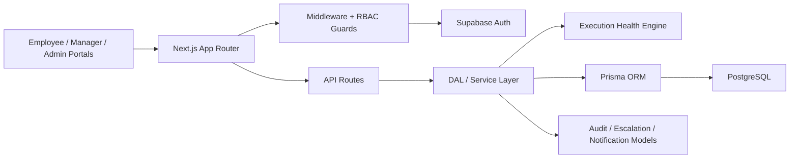

# AlignOps

AlignOps is an enterprise goal governance and execution intelligence platform built for AtomQuest Hackathon 1.0. It is designed as a believable internal operating layer for a 5000+ employee organization: employees define and execute goals, managers govern approvals and risk, and admins run org-wide policy, audit, escalation, and reporting.

## What It Does

- Employee Goal Cockpit with progress rings, KPI confidence, SMART checks, quarterly timeline, nudges, blockers, and achievement forecasting.
- Manager Operating Center with prioritized approval queue, execution risk radar, needs-attention queue, manager effectiveness, performance distribution, escalations, and notification simulation.
- Admin Governance Control Tower with org health, department heatmaps, lifecycle matrix, audit intelligence, escalation tracking, unlock intervention, operational metrics, and CSV export.
- Deterministic Execution Health Engine with no external AI APIs.
- Seeded enterprise demo data that shows thriving, at-risk, delayed, escalated, and overloaded operating stories.

## Stack

- Next.js 14 App Router
- TypeScript strict mode
- Tailwind CSS
- Prisma ORM
- PostgreSQL via Supabase
- Supabase Auth utilities
- Zod validation
- Lucide icons
- Vercel deployment target

## Architecture

Architecture diagram: [`docs/architecture.mmd`](docs/architecture.mmd)



## Feature Matrix

| Area | Status |
| --- | --- |
| Auth/session architecture | Complete |
| Role-based access control | Complete |
| Employee, Manager, Admin portals | Complete |
| Goal creation, refinement, submit, approve, return, lock, unlock | Complete |
| Shared goals | Complete |
| Quarterly check-ins and progress scoring | Complete |
| Governance dashboards and reporting | Complete |
| Audit logs | Complete |
| Escalation rules and events | Complete |
| SMART scoring and KPI intelligence | Complete |
| Notification feed with Teams/email previews | Complete simulation |
| CSV export | Complete |
| Entra-ready identity placeholders | Complete placeholder |
| Real email/Teams integration | Optional future scope |
| Real-time updates | Optional future scope |

Detailed BRD coverage: [`docs/brd-coverage.md`](docs/brd-coverage.md)

## Demo Credentials

The Prisma seed creates application users and roles. Create matching Supabase Auth users with these emails. Recommended shared demo password: `AlignOps@123`.

| Role | Email | Story |
| --- | --- | --- |
| Admin | `aditi.rao@alignops.local` | Governance owner |
| Manager | `rohan.mehta@alignops.local` | Overloaded product manager |
| Manager | `manav.shah@alignops.local` | Healthy sales manager |
| Employee | `nisha.iyer@alignops.local` | Thriving employee |
| Employee | `aman.gupta@alignops.local` | At-risk employee |
| Employee | `kabir.ali@alignops.local` | Delayed and escalated employee |

Full walkthrough: [`docs/demo-walkthrough.md`](docs/demo-walkthrough.md)

## Setup

```bash
npm install
cp .env.example .env.local
npm run db:generate
npm run db:migrate
npm run db:seed
npm run dev
```

Required environment variables:

```bash
DATABASE_URL="postgresql://postgres:[password]@[host]:6543/postgres?pgbouncer=true&connection_limit=1"
DIRECT_URL="postgresql://postgres:[password]@[host]:5432/postgres"
NEXT_PUBLIC_SUPABASE_URL="https://your-project.supabase.co"
NEXT_PUBLIC_SUPABASE_ANON_KEY="your-anon-key"
SUPABASE_SERVICE_ROLE_KEY="your-service-role-key"
NEXT_PUBLIC_APP_URL="http://localhost:3000"
SKIP_ENV_VALIDATION="false"
```

Deployment guide: [`docs/deployment.md`](docs/deployment.md)

## Verification

```bash
SKIP_ENV_VALIDATION=true npm run typecheck
SKIP_ENV_VALIDATION=true npm run lint
SKIP_ENV_VALIDATION=true npm run build
```

## Cost-Conscious Architecture

AlignOps stays a modular monolith on purpose. Server components, Prisma, Supabase, deterministic scoring, on-demand CSV exports, and simulated notifications keep the architecture realistic for hackathon delivery while avoiding unnecessary queues, microservices, paid AI APIs, or enterprise messaging integrations.

## Scalability Roadmap

- Add Entra SSO group mapping through Supabase Auth metadata.
- Add real Teams adaptive cards and email delivery behind the existing notification model.
- Add historical cycle comparison once multiple production cycles exist.
- Add background escalation jobs for production schedules.
- Add observability with structured logs, error monitoring, and audit export retention.
- Add real-time manager/admin refresh for live demo and production operations.
